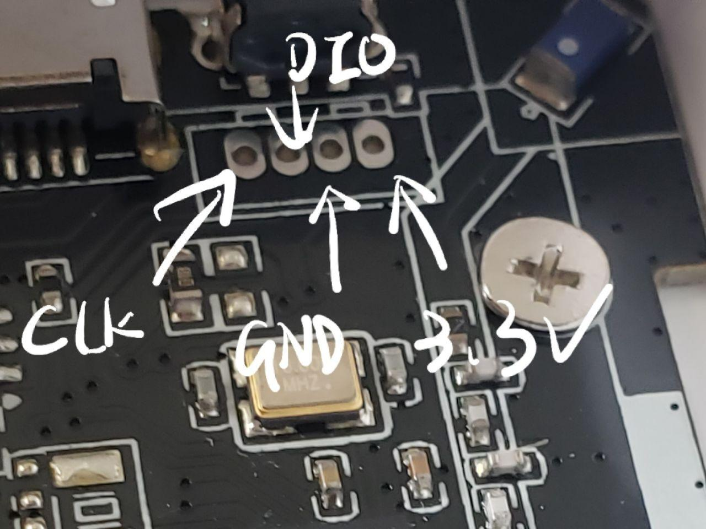

# PINOUT

## LEDs

|     PIN | Note                     |
| ------: | ------------------------ |
| `P0.01` | PMS Power latch          |
| `P0.03` | BAT voltage              |
| `P0.04` | PMS RX                   |
| `P0.05` | PMS TX                   |
| `P0.06` | USB D+                   |
| `P0.07` | USB D-                   |
| `P0.09` | Green leds in the circle |
| `P0.10` | Red leds in the circle   |
| `P0.11` | BAT charging             |
| `P0.12` | BAT standby              |
| `P0.21` | Power status             |
| `P0.22` | Bluetooth status         |
| `P0.23` | RTC I2C SDA              |
| `P0.24` | RTC I2C SCL              |
| `P0.29` | Power latch              |
| `P0.30` | BIG button               |

from <https://github.com/MarvelousBlack/hinata>

## Particulate Matter Sensor

|     PIN | Note   |
| ------: | ------ |
| `P0.05` | PMS Tx |
| `P0.04` | PMS Rx |

## Buttons

|         PIN | Note        |
| ----------: | ----------- |
| SWDIO(nRST) | Side button |

## SWD

