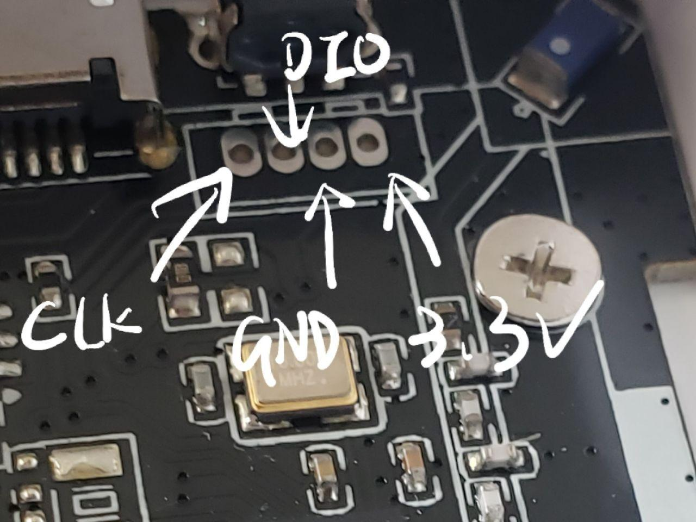

# Pinout

* SWD

* LEDs
  * Red leds in the circle: P0.10
  * Green leds in the circle: P0.09
  * Bluetooth status: P0.22
  * Power status: P0.21

* Particulate Matter sensor 
  * PMS Tx: P0.05
  * PMS Rx: P0.04

* Buttons
  * Side button: SWDIO(nRST)
